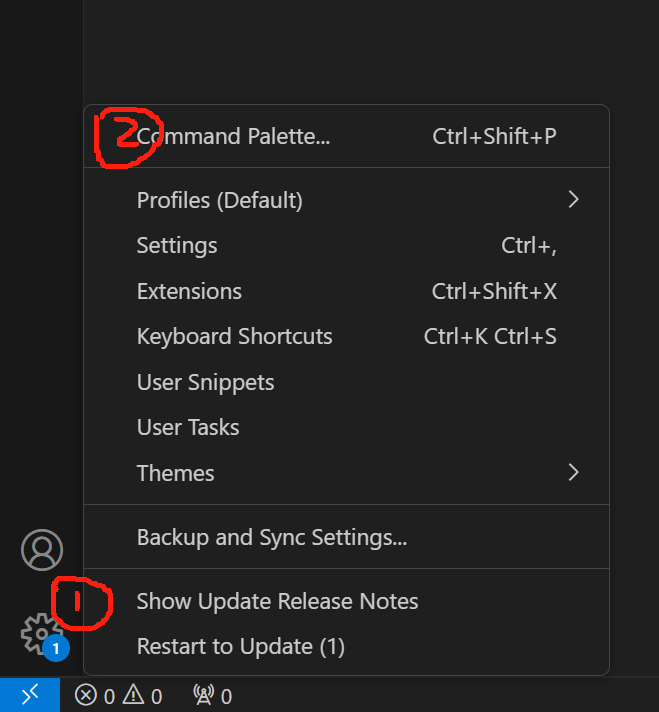
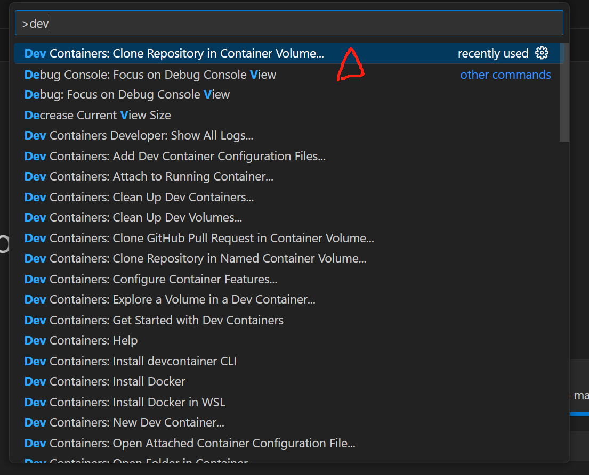
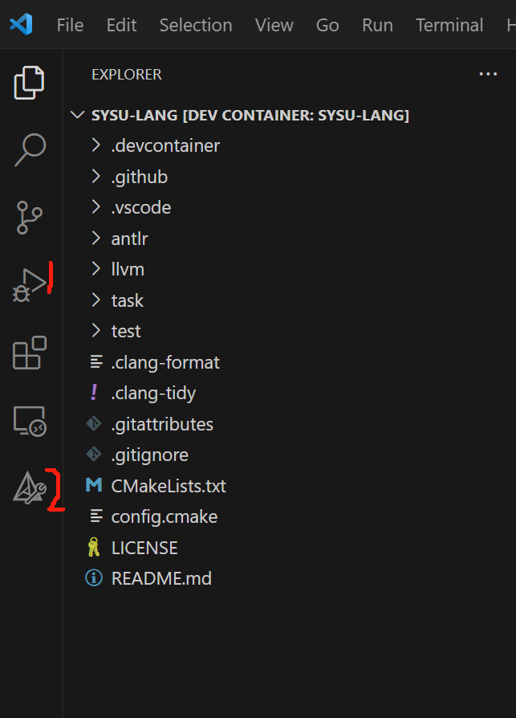

# 环境配置
在本小节中，我们会带领同学们完成实验环境配置。为了尽可能地还原同学们环境配置的过程，这里采用一台从来没有进行过开发的新电脑进行演示。


## 软件安装
由于大部分同学都是使用 `Windows` 电脑进行开发，所以这里采用windows11系统进行演示。首先需要同学们下载并安装以下三种软件。由于 `Windows` 系统下 `docker` 的正常使用需要 `wsl` 环境，所以请同学们在安装 `docker` 之前先安装 `wsl`。(对于 `linux` 系统和  `mac` 系统的同学而言，只需要跳过 `wsl` 的安装即可)
- wsl
- docker
- vscode

首先是WSL，WSL是Windows Subsystem for Linux的简称，它是微软在Windows操作系统上提供的一个功能，允许用户在Windows环境下运行Linux应用程序和命令行工具。简单来说，它让你可以在Windows系统中享受到Linux的强大功能。首先同学们需要打开自己的终端命令行，在其中输入以下代码，等待其安装即可。
```
wsl --install
```


然后是 docker 的安装，Docker 可以将代码、运行所需的运行时、系统工具和库进行打包。这可以使得同学进行实验代码开发的环境和我们助教开发实验时一模一样，减少了同学们环境配置的繁琐操作。
同学们直接在[以下网站](https://www.docker.com/products/docker-desktop/)下载，并进行图形界面的安装即可.

最后是vscode的安装，vscode是一款可以安装多种强大插件的开源代码编辑器，如果同学们选择vscode作为本次实验的代码编辑器，助教提前设计好的工作流将大幅提升你的开发效率。如果同学们选择其他代码编辑器将不能享受到这样的福利。vscode直接在[以下网站](https://code.visualstudio.com/)下载，并进行图形界面的安装即可.

## VSCODE配置
同学们打开vscode之后需要点击下图红色三角形所示的按钮，进入到插件管理界面进行dev containers插件的安装。


在同学们安装好 dev containers 之后，请将我们的实验代码仓库fork到自己的的github账户下，然后点击左下角的齿轮打开command palette



然后点击红色所示的按钮，vscode便会提示同学们登录自己的github账号，然后选择前面我们fork到自己账号下的的实验代码仓库，vscode便会自动开始实验环境的搭建与配置。



并在点击右下角的show log即可观察环境配置进度


待同学们使用 dev containers 构建完成之后 vscode的左侧会出现如下图所示的界面，数字`1`对应的按钮后续用于代码调试，数字`2`对应的按钮后续用于项目代码的编译构建。此时意味着环境搭建已经完成，下一小节会详细介绍框架的使用方法。




