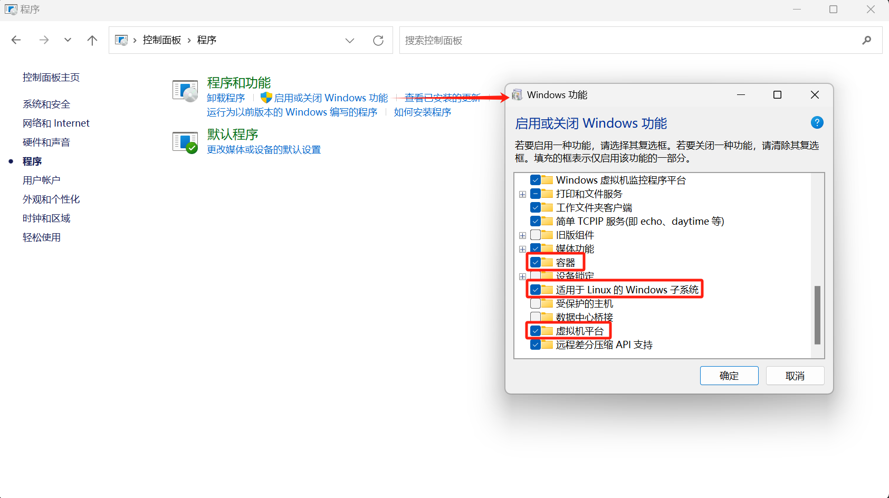
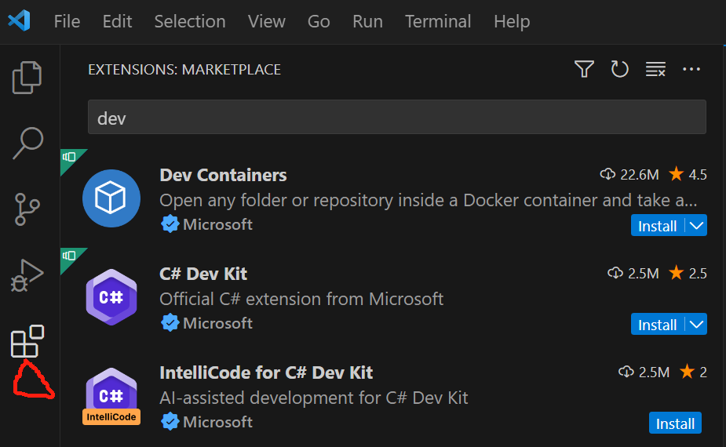
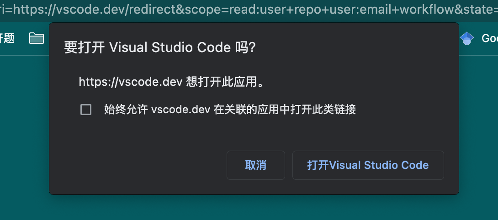

# 环境配置
在本小节中，我们会带领同学们完成实验环境配置。为了尽可能地还原同学们环境配置的过程，这里采用一台从来没有进行过开发的新电脑进行演示。


## 软件安装
由于大部分同学都是使用 `Windows` 电脑进行开发，所以这里采用windows11系统进行演示。首先需要同学们下载并安装以下三种软件。由于 `Windows` 系统下 `docker` 的正常使用需要 `wsl` 环境，所以请同学们在安装 `docker` 之前先安装 `wsl`。(对于 `linux` 系统和  `mac` 系统的同学而言，只需要跳过 `wsl` 的安装即可)。

需要安装的软件如下：

- wsl
- docker
- vscode

首先是WSL，WSL是Windows Subsystem for Linux的简称，它是微软在Windows操作系统上提供的一个功能，允许用户在Windows环境下运行Linux应用程序和命令行工具。简单来说，它让你可以在Windows系统中享受到Linux的强大功能。首先同学们需要打开 `控制面板-程序-启动或关闭 Windows 功能`，开启`容器`、`适用于 Linux 的 Windows 子系统`、`虚拟机平台`三个功能。



同学们需要打开自己的终端命令行，在其中输入以下代码，等待其安装即可。
```shell
wsl -l -v                       # 列举所有可安装的 Linux 系统
wsl --set-default-version 2     # 设置 WSL 默认版本号为2
wsl -d Ubuntu --install         # 安装 Ubuntu 系统
```


然后是 docker 的安装，Docker 可以将代码、运行所需的运行时、系统工具和库进行打包。这可以使得同学进行实验代码开发的环境和我们助教开发实验时一模一样，减少了同学们环境配置的繁琐操作。
同学们直接在[以下网站](https://www.docker.com/products/docker-desktop/)下载，并进行图形界面的安装即可.

最后是vscode的安装，vscode是一款可以安装多种强大插件的开源代码编辑器，如果同学们选择vscode作为本次实验的代码编辑器，助教提前设计好的工作流将大幅提升你的开发效率。如果同学们选择其他代码编辑器将不能享受到这样的福利。vscode直接在[以下网站](https://code.visualstudio.com/)下载，并进行图形界面的安装即可.

## VSCODE配置
同学们打开vscode之后需要点击下图红色三角形所示的按钮，进入到插件管理界面进行dev containers插件的安装。



在同学们安装好 dev containers 之后，请打开[实验 github 仓库页面](https://github.com/yhgu2000/SYsU-lang)，点击 `fork` 按钮，


然后同学们会看到出现以下界面，大家可以取一个自己喜欢的仓库名字，然后点击`create fork`


出现如下界面则意味着同学们已经完成仓库 `fork`


在同学们完成实验仓库的fork之后，请回到 vscode 点击左下角的红色数字 1 所指的齿轮，然后再点击红色数字 2 所指的按钮打开command palette


此时在vscode的顶部居中位置会出现如下图所示的内容，请同学们在出现的搜索栏中输入`Dev Containers`关键词，然后大家需要点击下图红色三角形所示的按钮`Dev Containers: Clone Repository in Container Volume`。


在这个时候 vscode 会出现下图所示的窗口提示同学们登录自己的 github 账号，请同学们点击下图中所示的`github`按钮


接着会出现如下图所示的窗口要求同学们确认是否同意该插件使用 github 账号进行登录，请同学们点击确认。


如果同学们的浏览器保存了 github 的登录信息，那么会出现下图所示的一个会话窗口，请同学们点击打开 vscode 即可。（如果同学们的浏览器没有保存 github 登录信息，需要多一个输入 github 账号密码进行登录的步骤）




成功授权 github 登录信息之后，同学们的电脑会回到 vscode 的界面，弹出如下所示窗口。请同学们选择前面我们 fork 到自己账号下的的实验代码仓库，选择主分支。


此时 vscode 便会自动开始实验环境的搭建与配置。点击右下角的 show log 即可观察环境配置进度


待同学们使用 dev containers 构建完成之后，就意味着实验相关的所有 linux  系统应用软件以及 vscode 插件都已经安装完成了。在下一小节中我们将会详细介绍如何使用实验框架。

## 注意事项

同学们在配置Dev Container环境时，请勿在Windows/Mac Terminal环境下直接克隆仓库或使用网站下载仓库代码，并在VS Code中选择`Dev Containers: Reopen in Container`选项进行搭建。这种做法会导致Dev Container和代码文件处于不同的操作系统中，在执行命令时产生巨大的性能开销。搭建Dev Container环境时建议使用如上文所述的`Dev Containers: Clone Repository in Container Volume`选项，让VS Code帮助我们自动下载仓库代码并安装容器。

<!--  -->


