# 环境配置
在本小节中，我们会带领同学们完成实验环境配置。为了尽可能地还原同学们环境配置的过程，这里采用一台从来没有进行过开发的新电脑进行演示。


## 软件安装
由于大部分同学都是使用 `Windows` 电脑进行开发，所以这里采用windows11系统进行演示。首先需要同学们下载并安装以下三种软件。由于 `Windows` 系统下 `docker` 的正常使用需要 `wsl` 环境，所以请同学们在安装 `docker` 之前先安装 `wsl`。(对于 `linux` 系统和  `mac` 系统的同学而言，只需要跳过 `wsl` 的安装即可)。

需要安装的软件如下：

- wsl
- docker
- vscode

首先是WSL，WSL是Windows Subsystem for Linux的简称，它是微软在Windows操作系统上提供的一个功能，允许用户在Windows环境下运行Linux应用程序和命令行工具。简单来说，它让你可以在Windows系统中享受到Linux的强大功能。首先同学们需要打开 `控制面板-程序-启动或关闭 Windows 功能`，开启`容器`、`适用于 Linux 的 Windows 子系统`、`虚拟机平台`三个功能。


同学们需要打开自己的终端命令行，在其中输入以下代码，等待其安装即可。
```shell
wsl -l -v                       # 列举所有可安装的 Linux 系统
wsl --set-default-version 2     # 设置 WSL 默认版本号为2
wsl -d Ubuntu --install         # 安装 Ubuntu 系统
```
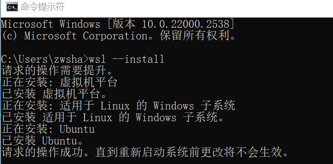

然后是 docker 的安装，Docker 可以将代码、运行所需的运行时、系统工具和库进行打包。这可以使得同学进行实验代码开发的环境和我们助教开发实验时一模一样，减少了同学们环境配置的繁琐操作。
同学们直接在[官方网站](https://www.docker.com/products/docker-desktop/)下载，并进行图形界面的安装即可.

最后是vscode的安装，vscode是一款可以安装多种强大插件的开源代码编辑器，如果同学们选择vscode作为本次实验的代码编辑器，助教提前设计好的工作流将大幅提升你的开发效率。如果同学们选择其他代码编辑器将不能享受到这样的福利。vscode直接在[官方网站](https://code.visualstudio.com/)下载，并进行图形界面的安装即可.

## (可选方案 1)dev containers 自动配置
同学们打开vscode之后需要点击下图红色三角形所示的按钮，进入到插件管理界面进行dev containers插件的安装。


在同学们安装好 dev containers 之后，请通过以下代码检查 docker 服务是否处于启动状态或者启动 docker 服务，如果显示类似如下图片中`active(running)`，则表示 docker 服务已经启动。
```bash
systemctl status docker  #查看 docker 状态
systemctl start docker   #启动 docker 服务
```

你也可以通过docker的图形化界面来确认docker服务的启动状态

确保 docker 服务处于启动状态后，请点击 vscode 左下角的红色箭头所指的齿轮，然后再点击另外红色箭头所指的按钮打开command palette

<!-- 请打开[实验 github 仓库页面](https://github.com/yhgu2000/SYsU-lang)，点击 `fork` 按钮，


然后同学们会看到出现以下界面，大家可以取一个自己喜欢的仓库名字，然后点击`create fork`


出现如下界面则意味着同学们已经完成仓库 `fork`

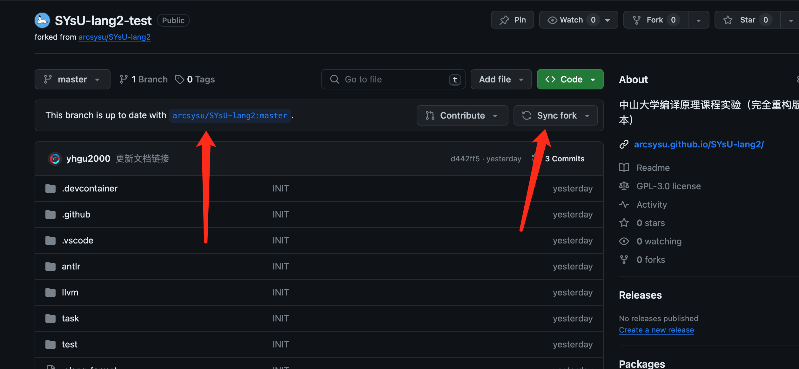 -->


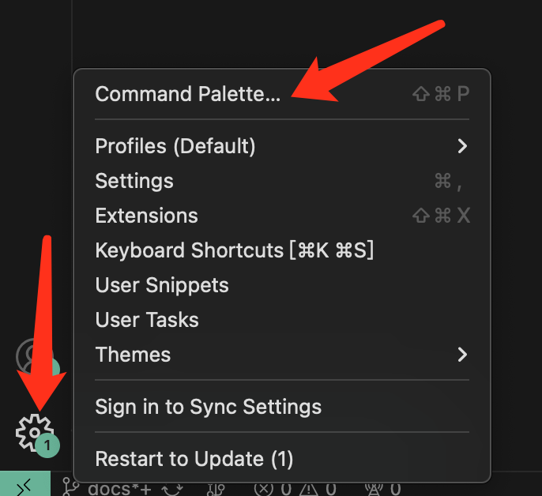

此时在vscode的顶部居中位置会出现如下图所示的内容，请同学们在出现的搜索栏中输入`Dev Containers`关键词，然后大家需要点击下图红色三角形所示的按钮`Dev Containers: Clone Repository in Container Volume`。

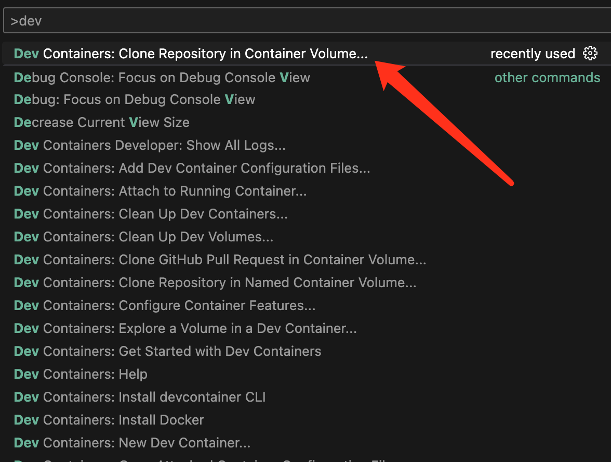

然后需要同学们在如下所示的界面输入实验仓库地址 `https://github.com/arcsysu/SYsU-lang2`，并且点击`clone git repository form URL`按钮。


<!-- 在这个时候 vscode 会出现下图所示的窗口提示同学们登录自己的 github 账号，请同学们点击下图中所示的`github`按钮


接着会出现如下图所示的窗口要求同学们确认是否同意该插件使用 github 账号进行登录，请同学们点击确认。

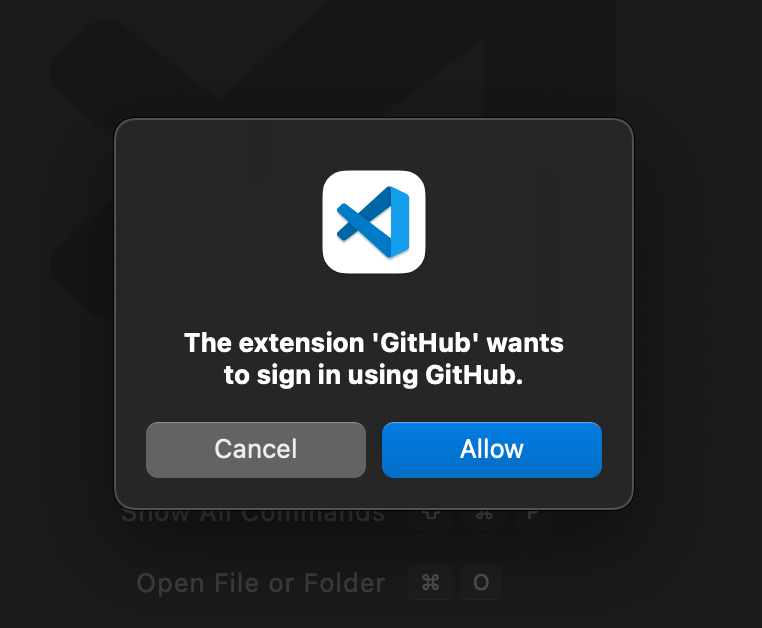

如果同学们的浏览器保存了 github 的登录信息，那么会出现下图所示的一个会话窗口，请同学们点击打开 vscode 即可。（如果同学们的浏览器没有保存 github 登录信息，需要多一个输入 github 账号密码进行登录的步骤）


成功授权 github 登录信息之后，同学们的电脑会回到 vscode 的界面，弹出如下所示窗口。请同学们选择前面我们 fork 到自己账号下的的实验代码仓库，选择主分支。

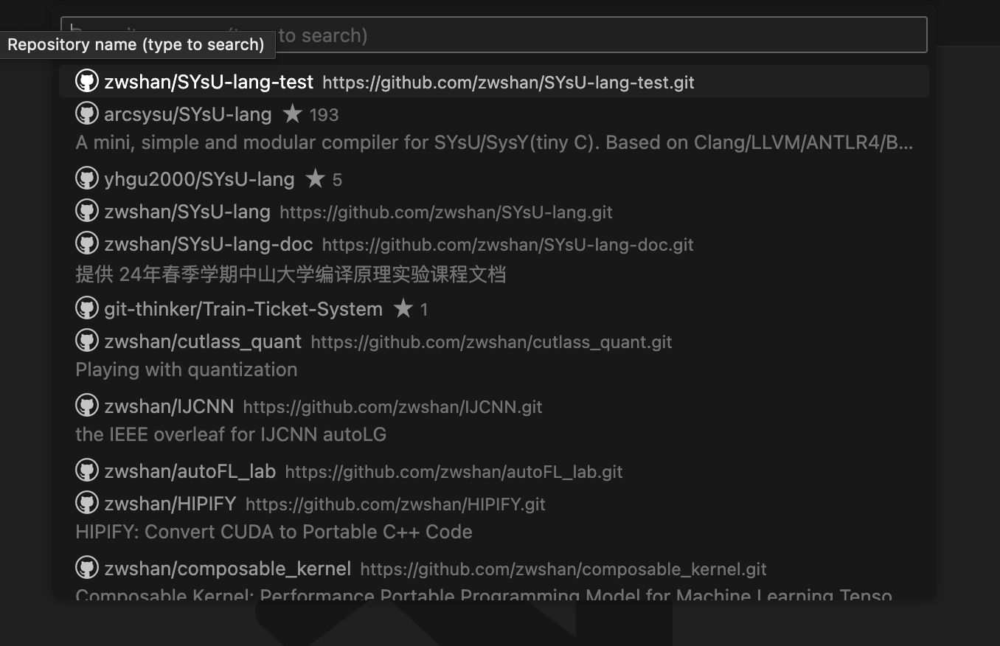 -->

此时 vscode 便会自动开始实验环境的搭建与配置。点击右下角的 show log 即可观察环境配置进度,

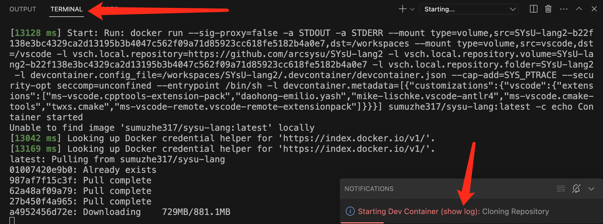

待同学们观察到上图所示的进度条达到100%或者消失，并且出现如下图所示的界面。使用 dev containers 进行自动构建的环境的操作就完成了。


如果顺利地话，vscode 的顶部还会弹出如图所示的窗口来提示同学们选择项目所示的编译器，请同学们选择箭头所示的clang14即可。


### 注意事项

1. 在配置Dev Container环境时，请勿在Windows/Mac Terminal环境下直接克隆仓库或使用网站下载仓库代码，并在 vscode 中选择`Dev Containers: Reopen in Container`选项进行搭建。这种做法会导致Dev Container和代码文件处于不同的操作系统中，在执行命令时产生巨大的性能开销。搭建Dev Container环境时建议使用如上文所述的`Dev Containers: Clone Repository in Container Volume`选项，让 vscode 帮助我们自动下载仓库代码并安装容器。
2. 在搭建Dev Container时若出现网络问题，请检查本机（包括WSL2）代理是否开启以及git代理是否配置，并尝试在打开/关闭代理后重新搭建。

<!--  -->
## (可选方案 2)命令行手动配置（使用docker）
首先请同学们启动 vscode 软件，点击下图所示的按钮新建一个命令行窗口。


如果同学们使用的是 windows 系统，在这里需要输入以下命令进入 wsl，如果使用的是 mac 系统或者是 Linux 系统可以直接进行后续步骤。

```bash
wsl
```
然后，我们需要将实验远程仓库拉取到本地。请同学们直接在命令行输入以下命令，以下代码中的`https://mirror.ghproxy.com/`是一个github 代理，方便解决可能存在的 github 访问不稳定问题。当命令行显示如下`100%  xx done`字样时代表仓库拉取已经完成。此时在命令行输入 `ls` 命令可以看到`SYsU-lang2`实验代码文件夹。  

```bash
git clone https://mirror.ghproxy.com/https://github.com/arcsysu/SYsU-lang2
```


请同学们输入以下命令进入实验代码文件夹，并且查看实验代码文件夹路径。  
```bash
cd SYsU-lang2  #进入文件夹
pwd           #查看当前路径
```


之后，请在`vscode` 的左侧界面点击 `open folder`，并选择前文中我们通过`pwd`命令获取的路径

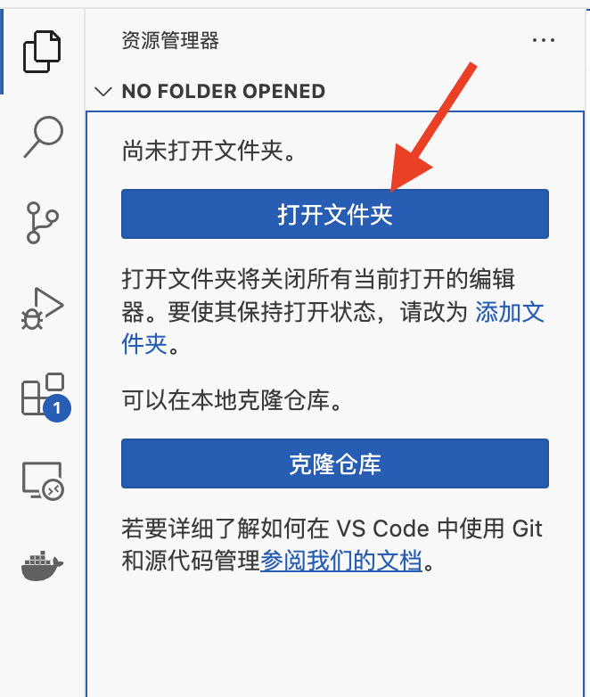

成功后，`vscode` 的左侧便会出现一个如下图所示的文件资源管理器，方便同学们进行图形界面的操作。  

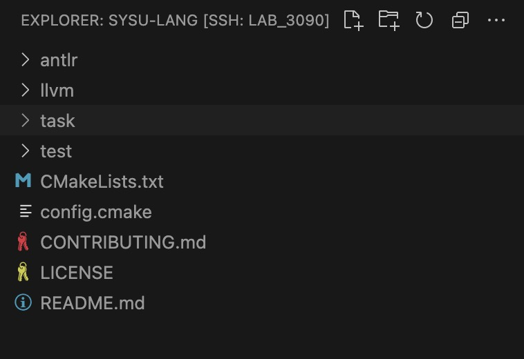  
接下来，为避免软件版本冲突以及影响同学们的系统环境，推荐同学们在 docker 内进行本实验环境配置。所以需要同学们在终端输入如下命令中的一条查看 docker 服务状态或者启动 docker 服务
```bash
systemctl status docker  #查看 docker 状态
systemctl start docker   #启动 docker 服务
```


你也可以通过docker desktop来确认docker服务的启动状态

如果确认 docker 已经是运行状态则可以进行下一步操作。在命令行窗口输入以下命令进行ubuntu 镜像的拉取。
```
docker pull ubuntu:22.04
```
出现以下输出字样则代表镜像拉取已经完成，


我们需要将拉取下来的 ubuntu 镜像实例化为一个容器，并在容器内进行实验环境的配置。但是在将镜像实例化为容器之前，
在我此时的例子中，我的代码文件所在文件夹为`/Users/nickchen/SYsU-lang2`。有了这个文件路径之后就可以开始将前面拉取的镜像实例化为一个容器了。请大家在命令行输入如下命令  
注意⚠️：将里面的`/Users/nickchen/SYsU-lang2`改为你先前设置的仓库的路径（即上文`pwd`命令得到的路径）
```bash
docker run -it --name labdemo -v /Users/nickchen/SYsU-lang2:/workspace   ubuntu:22.04
# docker run是运行 Docker 容器的命令
# -it 是两个选项的结合。-i 表示交互式操作，允许用户与容器进行交互，-t 表示分配一个伪终端（pseudo-TTY）。这使得用户可以在容器内执行命令，并且能够与命令行进行交互。
# --name labdemo表示将运行的容器命名为 labdemo
# -v /Users/nickchen/SYsU-lang2:/workspace 代表将宿主机的 /Users/nickchen/SYsU-lang2 路径映射到 docker 容器内的 /workspace 路径
```
当同学们在命令行看到`root@xx`等字样时意味着成功将镜像实例化为了容器，此时输入`cd workspace`即可成功进入实验代码文件夹。


在成功进入 `docker` 容器之后同学们需要在容器内进行实验环境的搭建，安装一些实验必需的应用软件。首先需要同学们输入以下命令安装以下软件：
```bash
apt-get update # 更新软件包列表信息
apt-get install -y ninja-build clang-14 wget cmake xz-utils g++ lld flex bison # 下载软件
```
以下是上述软件的简要介绍
|  软件   | 简介  |
|  ----  | ----  |
| ninja-build  | 一个用于加速软件编译速度的软件 |
| clang-14  | 安装实验必需的一个编译器 |
| wget  | 一个Linux 系统下的下载软件，类似迅雷在 win 的地位 |
| cmake  | 一个开源的跨平台的构建工具，用于自动生成各种不同编译环境下的构建脚本，帮助管理和构建 C/C++ 项目。 |
| xz-utils  | 一个解压软件 |
| unzip | 正如其名 |
| g++  | 实验必需的编译器 |
| lld  | 实验必需的链接器 |
| flex    | 你将很快接触到它 |
| bison   | 你将没那么快但也很快接触到它 |
    

在上述软件成功安装之后，请大家输入以下命令进行另外两个特殊软件的安装,两种软件在对应文件夹下都有助教提前写好的自动化编译安装脚本。  


首先是llvm软件
```bash
cd /workspace/llvm && bash install.sh
```
成功编译安装后的界面如下图所示(就是无事发生)
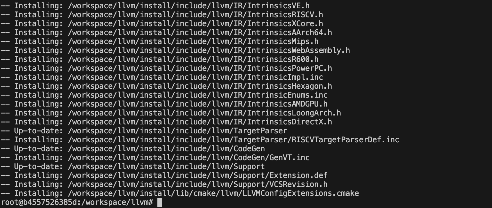

接下来是antlr 软件的安装，请大家在命令行输入如下命令。
```bash
cd /workspace/antlr && bash install.sh
```
成功编译安装后的界面如下图所示(也就是无事发生)
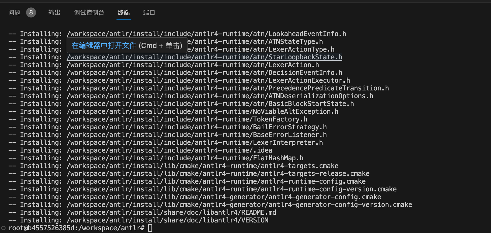

<!--  -->
注意⚠️：因为编译是计算密集型任务，此步骤耗时可能较长，如果你不能成功编译，你可以尝试以下的方法：
1. 重新编译  
```bash
cmake --build build --target clean
cmake llvm -B build -G Ninja\
  -DCMAKE_BUILD_TYPE=Release \
  -DCMAKE_INSTALL_PREFIX=$(realpath install) \
  -DLLVM_ENABLE_PROJECTS="clang" \
  -DLLVM_TARGETS_TO_BUILD="X86" \  #如果你使用的是Apple Silicon，则需改为 "AArch64"
  -DLLVM_USE_LINKER=lld \
  -DLLVM_INCLUDE_BENCHMARKS=OFF \
  -DLLVM_INCLUDE_EXAMPLES=OFF \
  -DLLVM_INCLUDE_TESTS=OFF
cmake --build build --target install
```
  
2. 在docker desktop中为你的容器增加Memory limit/Swap，并重新编译  
在以下 linux 系统软件安装完成之后，我们还需要安装一系列 vscode 插件，以便更方便地进行实验代码的编写。请同学们按照以下同学所示的方法，打开 vscode 的插件安装界面。


需要安装的 vscode 插件名字列表如下
```bash
C/C++
C/C++ extension pack
CMake
CMake Tools
ANTLR4 grammar syntax support
Yash
```

你也可以打开筛选以快速找到这些插件  
  

当前面所提到的 linux 系统软件以及 vscode 插件全部安装完成后，就完成了手动配置实验环境。

## (可选方案 3)命令行手动配置（不使用docker）  
施工中👷……