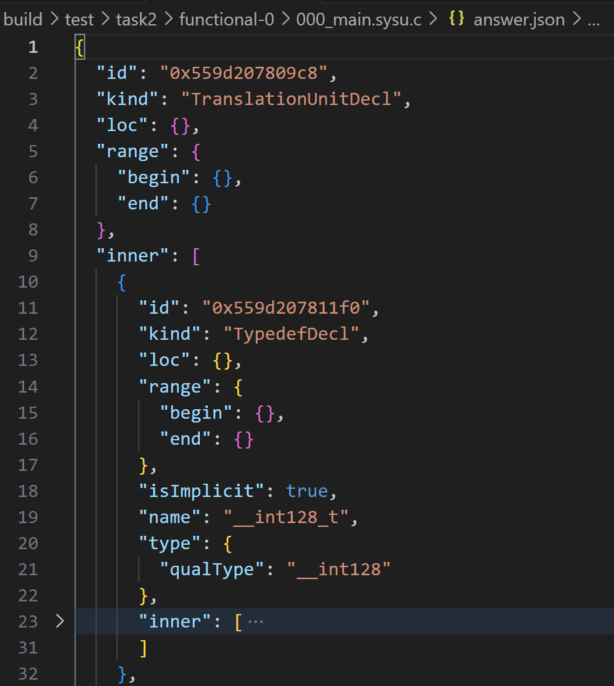
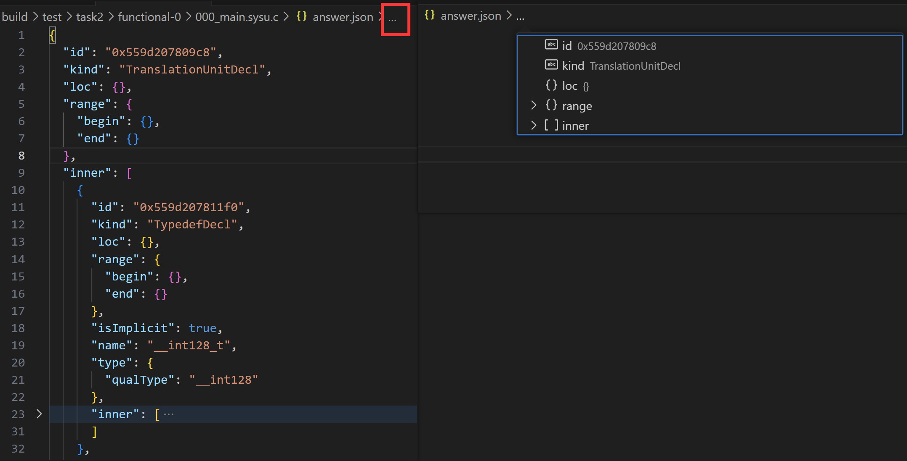

# 使用bison完成实验二

以复活版本的为例。

## 相关知识

### bison介绍

flex和bison进行配合使用，可以完成词法分析和语法分析。

输入一个文件，flex可以对该文件进行正则表达式的匹配，从而生成一系列的token流（这个大家在实验一中已经很清楚了）。

而lex生成每一个token之后，将其传给bison进行处理：bison会对当前传入的token进行语法分析，即文法的匹配，并进行相应移进归约操作，从而完成语法分析。

同时，我们可以在bison进行移进归约操作的时候，进行自定义语义动作，从而可以完成语法分析。

bison的使用方式很简单，同学们可以看下述链接：

- https://www.gnu.org/software/bison/manual/ 这是bison的官方文档，不建议立即看，在熟悉bison以后用于查找一些具体用法比较好。
- 可以找一些知乎CSDN等文章，下面这一篇是我找的，同学们可以上网搜更多的去看看，先对bison有个具体的了解：https://zhuanlan.zhihu.com/p/111445997
- 需要看顾宇浩助教的攻略“Flex和Bison的使用范式”部分，其中重点理解$n的使用：https://github.com/arcsysu/SYsU-lang/wiki/%E9%A1%BE%E5%AE%87%E6%B5%A9%E5%8A%A9%E6%95%99%E7%9A%84%E5%AE%9E%E9%AA%8C%E6%94%BB%E7%95%A5#flex%E5%92%8Cbison%E7%9A%84%E4%BD%BF%E7%94%A8%E8%8C%83%E5%BC%8F
（可能需要翻墙，如果不能翻墙的同学请查看：https://blog.csdn.net/u014132143/article/details/129489861 ）

其实，在本实验中，需要理解bison的使用就是两个重要部分：文法书写和语义动作定义。

```cpp
start : translation_unit ; //这是文法的定义，表示start终结符可以推导为translation_unit终结符
```

在文法后面加入 `{}`，可以定义语义动作，语义动作是用Ｃ语言代码进行撰写，表示文法在进行规约的时候应该执行的代码。

```cpp
start
	: translation_unit //在最后进行加入，代表在规约的时候将执行{}中的代码。
		{
		par::gTranslationUnit.reset($1); 
		}　
	;
```

### ASG（抽象语义图）介绍

相比起AST（抽象语法树），在本实验中使用ASG（抽象语义图）更为恰当和合适（类似于AST，只是其的一种简化or变体，更能将其方便的json的转化和输出）。

同学们可以看顾宇浩助教的攻略“设计抽象语义表示”部分进行理解：
https://github.com/arcsysu/SYsU-lang/wiki/%E9%A1%BE%E5%AE%87%E6%B5%A9%E5%8A%A9%E6%95%99%E7%9A%84%E5%AE%9E%E9%AA%8C%E6%94%BB%E7%95%A5#%E8%AE%BE%E8%AE%A1%E6%8A%BD%E8%B1%A1%E8%AF%AD%E4%B9%89%E8%A1%A8%E7%A4%BA
（可能需要翻墙，如果不能翻墙的同学请查看：https://blog.csdn.net/u014132143/article/details/129489861 ）

看完之后，其实能够理解到ASG就是一种可以储存代码中的各个不同结构（比如，表达式，句子，声明）的一堆结构体就可以了。

我们使用ASG结构并不是必须的，只是为了在中间进行储存这些文法结构，从而方便地进行之后的json打印，这只是一种代码设计的方案。

### 文法
本实验采用的文法是SysY语言（编译器比赛中所定义的语言用的文法），其文法如下。

目前提供的代码中的文法可能与下述给出的有细微不相同，但是表达的是一个意思，这无伤大雅，同学们可以作参考。
```
start         ::= CompUnit; // start为开始符号
CompUnit      ::= [CompUnit] (Decl | FuncDef);

Decl          ::= ConstDecl | VarDecl;
ConstDecl     ::= "const" BType ConstDef {"," ConstDef} ";";
BType         ::= "int" | "char" | "long long";
ConstDef      ::= IDENT {"[" ConstExp "]"} "=" ConstInitVal;
ConstInitVal  ::= ConstExp | "{" [ConstInitVal {"," ConstInitVal}] "}";
VarDecl       ::= BType VarDef {"," VarDef} ";";
VarDef        ::= IDENT {"[" ConstExp "]"}
                | IDENT {"[" ConstExp "]"} "=" InitVal;
InitVal       ::= Exp | "{" [InitVal {"," InitVal}] "}";

FuncDef       ::= FuncType IDENT "(" [FuncFParams] ")" Block;
FuncType      ::= "void" | "int";
FuncFParams   ::= FuncFParam {"," FuncFParam};
FuncFParam    ::= BType IDENT ["[" "]" {"[" ConstExp "]"}];

Block         ::= "{" {BlockItem} "}";
BlockItem     ::= Decl | Stmt;
Stmt          ::= LVal "=" Exp ";"
                | [Exp] ";"
                | Block
                | "if" "(" Exp ")" Stmt ["else" Stmt]
                | "while" "(" Exp ")" Stmt
                | "break" ";"
                | "continue" ";"
                | "return" [Exp] ";";
                | "do" "{" Stmt "}" "while" "(" Stmt ")" ";"

Exp           ::= LOrExp;
LVal          ::= IDENT {"[" Exp "]"};
PrimaryExp    ::= "(" Exp ")" | LVal | Number;
Number        ::= INT_CONST;
UnaryExp      ::= PrimaryExp | IDENT "(" [FuncRParams] ")" | UnaryOp UnaryExp;
UnaryOp       ::= "+" | "-" | "!";
FuncRParams   ::= Exp {"," Exp};
MulExp        ::= UnaryExp | MulExp ("*" | "/" | "%") UnaryExp;
AddExp        ::= MulExp | AddExp ("+" | "-") MulExp;
RelExp        ::= AddExp | RelExp ("<" | ">" | "<=" | ">=") AddExp;
EqExp         ::= RelExp | EqExp ("==" | "!=") RelExp;
LAndExp       ::= EqExp | LAndExp "&&" EqExp;
LOrExp        ::= LAndExp | LOrExp "||" LAndExp;
ConstExp      ::= Exp;
```
如果需要SysY语言更为详细的文法解释和定义，可以参考该链接：https://gitlab.eduxiji.net/nscscc/compiler2021/-/blob/master/SysY%E8%AF%AD%E8%A8%80%E5%AE%9A%E4%B9%89.pdf

## 任务描述

在本实验中，我们的任务是进行语法分析，然后生成json文件，例如同学们可以看下其中的一个文件：`/workspaces/SYsU-lang2/build/test/task2/functional-0/000_main.sysu.c/answer.json`
该json文件是clang parse生成的标准答案，而我们也需要生成这样的答案。


下面对这个文件进行一些说明：

这个文件太长、不太好看结构，但是所幸vscode可以很简便的看到结构，我们采取下述方式:将鼠标移到该json文件中，其下面红框部分就会显示这个文件的结构，从而可以很方便的进行整体查看该结构。


以这个文件为例，其最外层的结构的kind（种类）为TranslationUnitDecl，然后其有个属性为inner，包含其余6个部分（0-5）：前5个都是TypedefDecl（这个不用管），最后一个是FunctionDecl，将其进行展开继续查看。


由该文件，可以得到其整体结构为：
```bash
|-- TranslationUnitDecl
   |-- 多个TypedefDecl（不用管）
   |-- FunctionDecl
      |-- CompoundStmt
         |-- ReturnStmt
            |-- IntegerLiteral
```


### 评分标准
同学们查看json文件，会发现上述每个节点里面包含了非常多的属性，除去TypedefDecl不用管之外，我们的评分以属性打印为准，具体如下：
- 是否提取出正确的 "kind"、"name"、"value" 键值，不含 "InitListExpr"（60 分）
- 是否提取出正确的 "type" 键值及是否构造正确的 "InitListExpr" 生成树（30 分）。
- 是否提取出其它非 "id" 以外的键值（10 分）。

## 总体思路(main.cpp)

以main.cpp为入口，实验2首先进行语法分析：`yyparse`（在其中进行填充ASG的结构），然后进行类型检查 `typing(*par::gTranslationUnit)`，最后将asg生成json文件 `asg2json`，并且写入指定文件。

在语法分析中，bison的 `yyparse`中有下面的逻辑：

- 由于实验2以复活版本的进行实验，因此输入的是task1-answer，同学们可以看下其中的一个文件：`/workspaces/SYsU-lang2/build/test/task1/functional-0/000_main.sysu.c/answer.txt`，如下图所示


- `bison`会读取词法分析`lex`中的传入的`token`（`lex`每读取一个，就会传给`bison`进行语法分析），因此将上述文件输入到实验2中，此时词法分析`lex`相关部分代码比起实验一会发生变化，不过这一部分的代码目前已经写好了，同学们可以自行查看。
  （其逻辑是：相比于实验一的输入直接是源文件从而进行相关的各个`token`的匹配，实验二复活版本将匹配上述输入文件的每一行，然后对每一行进行处理，提取出每行的第一个单词（`tokenId`）和每行的第二个单词中的引号内容（`tokenValue`）。例如，以一行为例，识别出的`token`：其`tokenId`为`int`，其`tokenValue`为引号内的内容，也为`int`。）
- `bison`拿到该`token`后，首先进行文法的匹配，进行移进归约操作，而后在每个移进归约的过程中完成用户自定义的语义动作，在本实验中，我们是生成并填充ASG结构。

在类型检查中，`typing`则将对生成的ASG中的每一个结构进行类型检查，如果不通过该类型检查，程序就会停止。同学可以利用这个方便地进行查错，判断自己到底是哪个类型没有写对。

在ASG生成json文件中，`asg2json`将在yyparse中生成并通过类型检查的ASG结构进行输出并打印。

而类型检查和ASG生成json文件的部分，已经进行了基本的实现，同学们只要负责**语法分析中的文法撰写和语义动作撰写**即可，即，`par.y`文件的补充。（如果想要拿到评分标准的第三档，可能需要自行在ASG中添加结构，并在asg2json部分进行打印，不过当同学们完成评分标准的前两档，已经对ASG和asg2json有全面的了解，因此是不太难的事情。如有任何困难，欢迎问助教。）

## 文件结构说明

对实验整体的整体过程有了把握，我们接下来看下这部分实验文件的整体结构。

```bash
-- bison
   |-- lex.cpp
   |-- lex.hpp
   |-- lex.l
   |-- main.cpp
   |-- par.cpp
   |-- par.hpp
   |-- par.y
-- common
   |-- Asg2Json.cpp
   |-- Asg2Json.hpp 
   |-- Typing.cpp
   |-- Typing.hpp
   |-- asg.hpp
```

其中 `common`是共有文件，包含了：ASG结构定义文件 `asg.hpp`，类型检查需要用到的文件:`Typing.hpp`和 `Typing.cpp`，ASG转换为Json的文件：`Asg2Json.hpp`和 `Asg2Json.cpp`。

其具体解析见公共代码介绍。

其中 `bison`是本实验的部分，包含了：

- `main.cpp` 程序入口，详细解析见上述总体思路。
- 词法分析相关文件：复活版本（即从标准答案task1-answer中进行读取），包含了：`lex.l`，`lex.hpp`和 `lex.cpp`文件。其中 `lex.l`是用于写词法分析的规则部分，`.hpp`和 `.cpp`文件是用于定义相关辅助函数的文件。
- 语法分析相关文件：包含了：`par.y`，`par.hpp`和 `par.cpp`文件。其中其中 `par.y`是用于写语法分析相关的文法以及语义动作，`.hpp`和 `.cpp`文件是用于定义相关辅助函数的文件。

## 代码说明和解析

这个部分将会对重点代码进行说明和解析，同时，将会以一个文法为小例子进行讲解，方便同学们理解。

### 以一个简单的文法为例子说明
举一个例子，语句的文法其中一种表示如下：
```bash
statement -> compound_statement
	| expression_statement（表达式语句）
	| selection_statement（选择语句）
	| iteration_statement（迭代语句）
	| jump_statement ; （跳转语句）
```   
其中选择语句的文法的其中一种表示如下：
```bash
selection_statement -> IF '(' expression ')' statement
| IF '(' expression ')' statement ELSE statement;
```
**文法撰写：**

则在`par.y`文件中添加的代码应该如下表示。这个文法代码的添加非常简单，只需要按照`bison`的语法把`->`变为`:`即可。

```cpp
// 只是部分文法，并不是全面的
statement
   : compound_statement
   | expression_statement
   | jump_statement
;
jump_statement
   : RETURN ';' 
   | RETURN expression ';'
;
```
**语义动作撰写：**
从语法分析树直接转化到JSON的输出是十分困难的，我们需要进行一些封装和转换，从而可以简便地通过`bison`的语义动作进行填充定义的ASG结构，从而为之后的json转化做铺垫。

由刚刚的例子，我们在`asg.hpp`中语句找到对应的结构（对于一些结构体的含义不太清楚的，可以通过`asg2json.cpp`中的每个结构的打印方式即可知道该结构体对应的是什么，建议同学们都看看`asg2json.cpp`这样对结构体的含义更为清晰，也以免出错。）
```cpp
struct Stmt : public Obj // 语句
{};

struct CompoundStmt : public Stmt // 复合语句
{
std::vector<Stmt*> subs;
};

struct ReturnStmt : public Stmt // Return语句
{
  FunctionDecl* func{ nullptr };
  Expr* expr{ nullptr };
};
```
则想要对刚刚文法生成相应的ASG结构则要进行填充，则在刚刚bison的文法代码上加上语义动作如下。即匹配到了相应的文法之后，所进行的代码动作。
```cpp
statement // Stmt
  : compound_statement 
    { 
      $$ = $1; 
    }
  | expression_statement 
    { 
      $$ = $1; 
    }
  | jump_statement 
    { 
      $$ = $1; 
    }
  ;
jump_statement // ReturnStmt
  : RETURN ';' 
    {
      auto p = &par::gMgr.make<asg::ReturnStmt>();
      $$ = p;
    }
  | RETURN expression ';'  
    {
      auto p = &par::gMgr.make<asg::ReturnStmt>();
      p->expr = $2;
      $$ = p;
    }
  ;
```
解释`statement`的语义动作：
- `$$ = $1;` 直接将`statement`的值令为文法左边第一个符号的值。

解释`selection_statement`的语义动作：
- 使用`&par::gMgr.make<asg::ReturnStmt>();`进行构造`ReturnStmt`结构体。具体可以看`make`的代码，只要是直接或间接继承于`Obj`类型的都可以用这个构造器进行构造。
然后填充该结构体，根据asg的定义，需要填充`func`、`expr`结构，在这里只能填充`expr`结构。
- 显然`$2`（文法右边第二个表示为`expression`，用`$`进行取出）为该语句的`expression`，因此有`p->expr = $2;`
- `$$ = p;` `$$`为文法右边的值即`jump_statement`的值，则此动作为将该`jump_statement`的值设置为`ReturnStmt`的值。


记得`par.y`相对应的地方进行类型的定义。以`compound_statement`为例。

```cpp
%union {
   asg::CompoundStmt* CompoundStmt;  // 首先进行类型的命名
}

%nterm <CompoundStmt> compound_statement // 然后即可再此使用
```

其实最后所有文法的语义动作总的生成的就是一个`TranslationUnit`的结构体，其中包含了所有的ASG的信息，可以查看下面的代码。最后`asg2json`就是抓住这个节点以其为根，然后进行遍历其中进行打印出相应所有的节点。
```cpp
start
   : translation_unit 
      {
      par::gTranslationUnit.reset($1); 
      }
   ;
```
## 如何debug

### yydebug
yyparse部分出现问题，即bison的文法规约等出现问题，直接设置yydebug为1即可。在main.cpp中加入以下的代码。

即可打印出详细的bison文法移进规约栈的信息，从而进行定位。

需要提醒的是，这部分是不适合不适合使用断点进行调试的，因为其会跳到bison生成的代码进行状态的不断跳转，根本不知道文法到底归约到哪里了。

文法的移进规约直接使用yydebug，而其语义动作的定位再配合`std::cout`打印即可。

### 断点调试
在`Typing`和`Asg2Json`部分使用使用断点调试，看下是哪一部分生成不到位出了问题。配合`std::cout`打印更佳。

### 输出到文件
有时候编译很顺畅的进行通过的时候，`std::cout`是打印不出的，因此这个时候可以将`std::cout`写入到文件里面。例如可以定义以下函数，然后使用该函数就可以打印到指定文件，即可进行debug。
```cpp
void printToTxtFile(std::string message) {
    std::ofstream myfile;
    myfile.open ("/workspaces/SYsU-lang/task/2/bison/log.txt", std::ios_base::app); // 'app' means appending to the end of the file, trunc: start of the file
    myfile << message << "\n";
    myfile.close();
}
```

## 可能会遇到的坑点

指针问题
